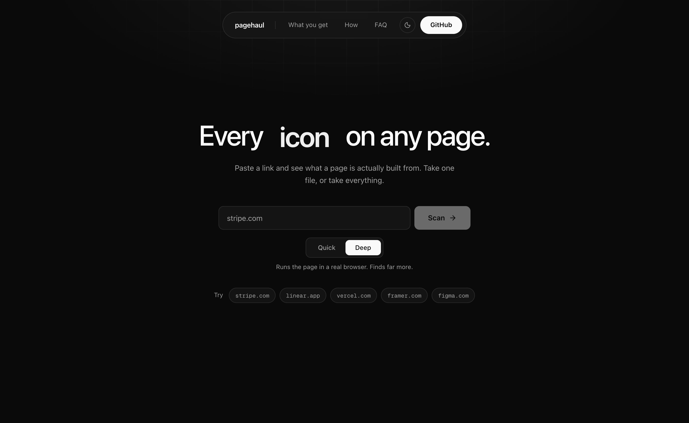
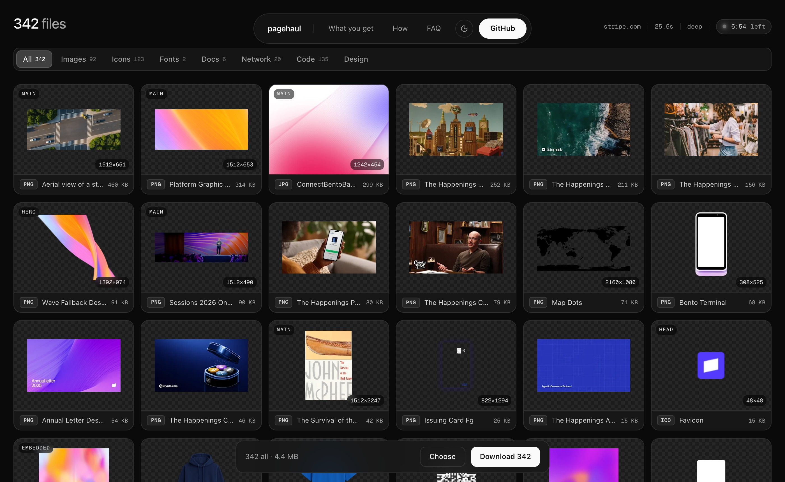
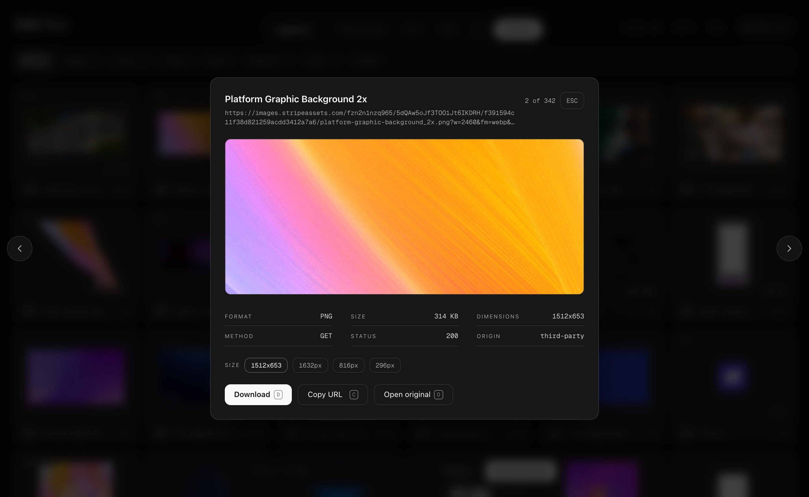
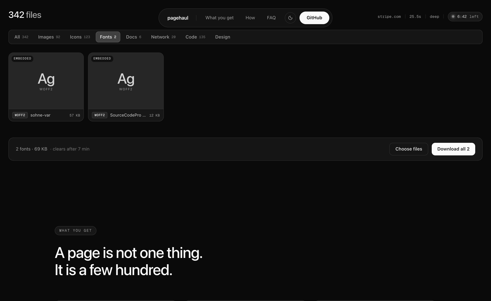
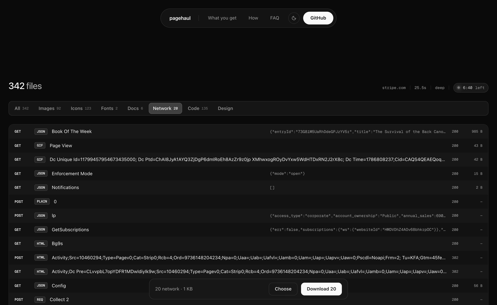
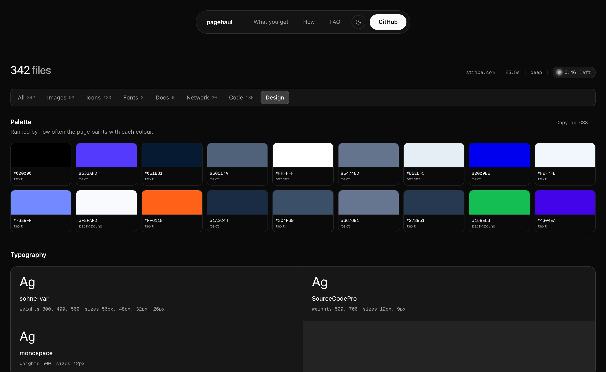
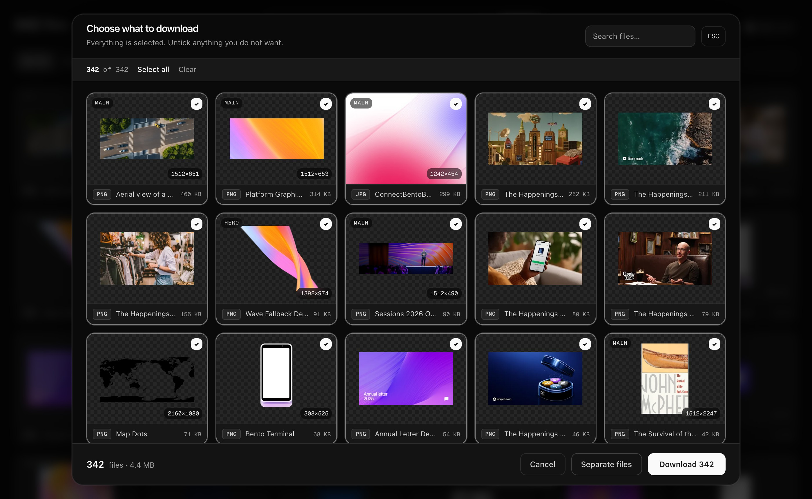

# pagehaul

**Paste a link. Take exactly the files you want.**

Every image, icon, video, font, document and network call a page is built from — in
one filterable grid. Click a file to take it. No DevTools, no ZIP to unpack, no
hunting through folders.



---

## What you get

A scan returns everything the page is made of, grouped by kind, named so you can read
it, and sized so you know what you are taking.



Click any file for the full-size look, its real dimensions, the response it came from,
and the other sizes the site publishes. Arrow keys walk the whole list without closing.



---

## How it works

**The server never touches asset bytes.** It opens the page, works out what the page is
made of, and returns a list of addresses. Your browser fetches each file straight from
the site it belongs to.

```
                    ┌──────────────────────────┐
  you ──url───────▶ │  /api/scan               │
                    │  static read + real      │──── the page, once
                    │  browser, merged         │
                    └────────────┬─────────────┘
                                 │ a list of addresses, ~500 KB of JSON
                                 ▼
                    ┌──────────────────────────┐
                    │  your browser            │
                    │  grid · filters · zip    │
                    └────────────┬─────────────┘
                                 │ fetches the files DIRECT from origin
                                 ▼
                          the original site
```

Nothing is stored. A scan of a 40 MB site moves about half a megabyte through the
server rather than 40, and there is no bucket, no database and no copy of anyone
else's page sitting anywhere.

### Quick and deep

| | Reads | Finds | Takes |
| --- | --- | --- | --- |
| **Quick** | the HTML and its stylesheets | what the markup declares | a few seconds |
| **Deep** | the above **plus** a real Chromium session | what the page actually loads | 15–40s |

Deep is a superset, not an alternative. Both run and the results merge, because
neither sees everything on its own:

- a **browser** only knows what it *fetched* — it never mentions the four `srcset`
  candidates it passed over, and inline SVG never crosses the network at all
- a **static read** only knows what is *declared* — it misses everything drawn after
  load

On framer.com the static read alone held 115 files the browser never saw, 91 of them
icons.

### Reading the payloads

An app fetches its content as JSON and then decides what to draw. If it draws
nothing — because it virtualises, or because a bot check quietly withheld the feed —
those pictures still went past, named in the payload. pagehaul reads them.

That is the difference between reporting what a page chose to render and reporting
what it actually holds. Measured across twenty of the most-used sites: YouTube went
from 4 pictures to 909, Amazon 4 to 229, IMDb 230 to 438.

---

## What it finds

**Images** — ``, every `srcset` and `<picture>` variant, lazy-load attributes, CSS
`url()` backgrounds, inline styles, favicons, Open Graph and Twitter cards, and
anything named in a JSON payload.

**Icons** — linked SVG, sprite sheets, and inline `<svg>` serialised so you can take it.

**Video and audio** — sources, poster frames, caption tracks. Tiles show a real frame
from the file rather than a play button on an empty square. Audio comes from the deep
scan alone, because the audio a page actually plays almost never sits in its markup: a
hover sound played through the Web Audio API never crosses the network during a scan
and builds no `<audio>` element, so its address is mined out of the site's scripts and
checked against the origin before it is listed.

**Fonts** — named by the typeface they declare, read from `@font-face` on the live page
and from fetched stylesheets. On framer.com: 350 fonts, 349 of them named.



**Network calls** — every XHR, fetch and GraphQL request the page made, with method,
status and a preview of the response body.



**The design itself** — the palette a page paints with, ranked by how often each colour
is used, the type it sets, and any CSS custom properties it declares. Click a swatch to
copy the hex, or take the whole palette as CSS.



---

## Three details worth knowing

**One card per picture, not one per size.** A CDN serves the same photograph at nine
widths. Left alone, a page holding forty pictures reports two hundred files and the one
you want is buried. Sizes are recognised from the shape of the address — a `/236x/`
path segment, a `-150x150` suffix, a `?w=` query, Cloudflare's `f=auto,width=2560` — and
collapsed into one entry. The other sizes are offered inside its preview, so nothing is
hidden.

**Thumbnails ask for a thumbnail.** A tile is about 200 pixels wide, and it used to be
filled with whatever the page referenced — in one case a 494 KB JPEG at 2240 pixels.
Tiles now request a size a tile can use, touching only knobs the address already
exposes and only ever downwards. One screen costs 0.59 MB instead of 1.89 MB.

**Files are named, not numbered.** Alt text first, then the path, and a filename that is
a hash or a set of CDN rendering options is skipped rather than shown. Where nothing
readable exists it says "Main image 4" — honest, and better than
`f=auto,fit=scale-down,metadata=none`.

---

## Choosing what to take

Take one file by clicking it, take everything with one button, or open the picker and
untick what you do not want. More than one file arrives as a zip with a manifest.



---

## Results clear themselves

A scan stays on screen for seven minutes and then goes. Nothing was stored server-side
to begin with — the list is addresses, and your browser does the fetching — so this is
about not leaving somebody else's page contents open in a tab indefinitely.

The last thirty seconds are visible: the tiles start shedding pixels, more of them as
the time goes, until the whole grid comes apart. They stay solid and clickable
throughout, so a download in progress is never interrupted.

---

## Running it

```bash
npm install
npm run dev        # http://localhost:3000
npm run build && npm start
```

No environment variables, no database, no object storage. Deep scan needs Chrome
installed locally; set `CHROME_PATH` if it is somewhere unusual.

### Contact form email

The contact form sends messages through [Resend](https://resend.com). Copy
`.env.example` to `.env.local`, add a `RESEND_API_KEY`, and verify the sending
domain used by `FEEDBACK_FROM` in Resend. Messages are delivered to
`pagehaul.contact@gmail.com` by default; set `FEEDBACK_TO` to override that
destination.

### API

```
POST /api/scan
{ "url": "stripe.com", "deep": true }
```

Returns `{ target, pages[], assets[], palette[], typography[], tokens[], ms, notes[] }`.

Repeat scans of the same address and depth are served from a five-minute cache — a
second deep scan of stripe.com goes from 24.6s to 0.01s.

Submitted addresses are resolved and checked against private, loopback, link-local and
multicast ranges before anything is fetched, and re-checked after redirects, so the
endpoint cannot be used to probe internal network space.

---

## Performance

The grid holds hundreds of files and stays at 60fps because it only mounts the rows you
can see. Measured over a 343-asset result set at quarter CPU speed: p90 frame time
18.4ms, no frame over 50ms, 882 DOM nodes rather than 4,812.

[`PERFORMANCE.md`](PERFORMANCE.md) has the full numbers, the things that turned out not
to be the problem, and what is still open.

---

## Stack

Next.js 16 App Router · TypeScript · Tailwind v4 · Puppeteer for the deep scan ·
cheerio for the static read · TanStack Virtual for the grid · fflate for client-side zip.

## Not built yet

Multi-page crawling, a relay for files whose origin refuses a cross-origin read, HLS and
DASH muxing, format conversion on download, and a browser extension for pages that need
your own session.
